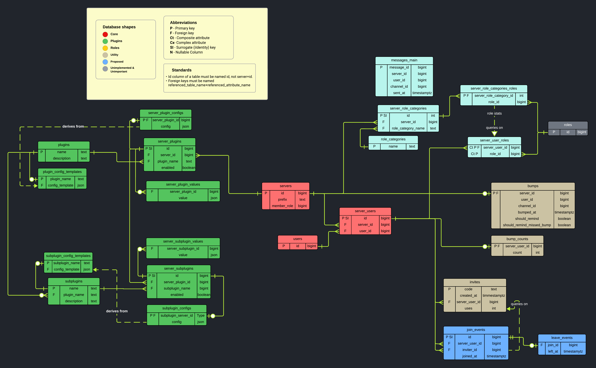

# ABotHasNoName

A Discord bot built using the `discord.py` wrapper API. It serves as a general-purpose bot with various features aimed at enhancing server management and engagement.

## Features

1. **Role Stats:** Provides graphical statistics for user-defined role categories.
2. **Message Count Leaderboard:** Tracks and displays a leaderboard based on message counts.
3. **Bump Reminder and Leaderboard:** Reminds users to bump the server, tracks bump counts, and displays a leaderboard.
4. **Invite Tracking and Leaderboard:** Tracks invites to the server, counts them, and displays a leaderboard.
5. **Server Lockdown and Backup Permissions:** Enables server lockdown and allows for backing up permissions.
6. **Supports Custom Prefixes**

## DataBase ERD

